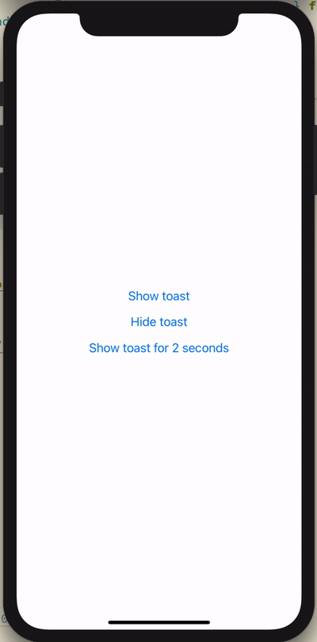

# React Native Toast Library

Simple toast library for both iOS and Android.

</img>

## Usage

1. `yarn add @vladimir-vovk/react-native-toast`
2. Add `ToastProvider` and `Toast` to your `App.tsx`:
```
...
import { ToastProvider, Toast } from '@vladimir-vovk/react-native-toast'

export default function App() {
  return (
    <ToastProvider config={{ timeout: 2000 }}>
      ...
      <Toast />
    </ToastProvider>
  )
}
```
3. Show toast in your code with `useToast` hook:
```
...
import { useToast } from '@vladimir-vovk/react-native-toast'


const Demo = () => {
  const { showToast } = useToast()

  const _onShowToast = () => {
    showToast('Hey, I am toast!')
  }

  return (
    <View style={styles.container}>
      <Button title="Show toast" onPress={_onShowToast} />
    </View>
  )
}

...
```

See [Demo]() for more details.

## Expo

You could run demo with [Expo Client](https://expo.io/@vladimir_vovk/) or [Expo Snack](https://snack.expo.io/) in your browser.
